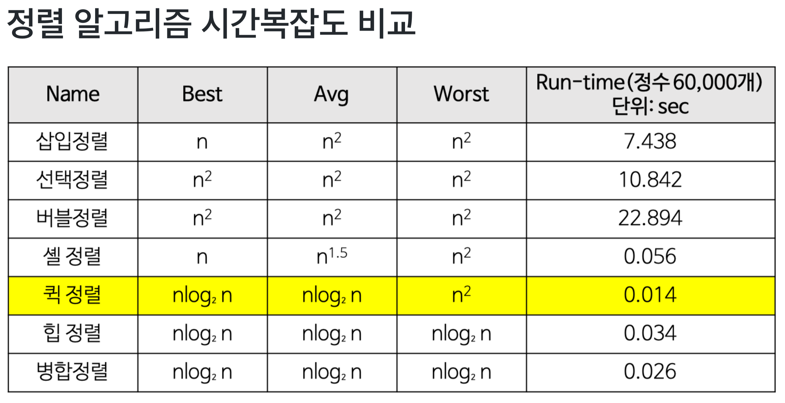

# 정렬

일반적으로 유명한 아래 5가지 정렬만 외워두도록 하자

| Name            |   Best   | Average  |  Worst   | Memory | Stable |
| --------------- | :------: | :------: | :------: | -----: | -----: |
| Quick(퀵)       |   `n`    | `n lg n` |  `n^2`   | `lg n` |     no |
| Merge(병합)     | `n lg n` | `n lg n` | `n lg n` |    `n` |    yes |
| Bubble(거품)    |   `n`    |  `n^2`   |  `n^2`   |    `1` |    yes |
| Insertion(삽입) |   `n`    |  `n^2`   |  `n^2`   |    `1` |    yes |
| Selection(선택) |  `n^2`   |  `n^2`   |  `n^2`   |    `1` |     no |

