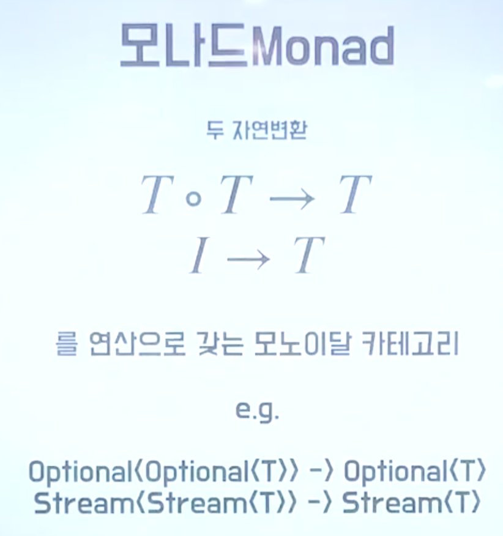
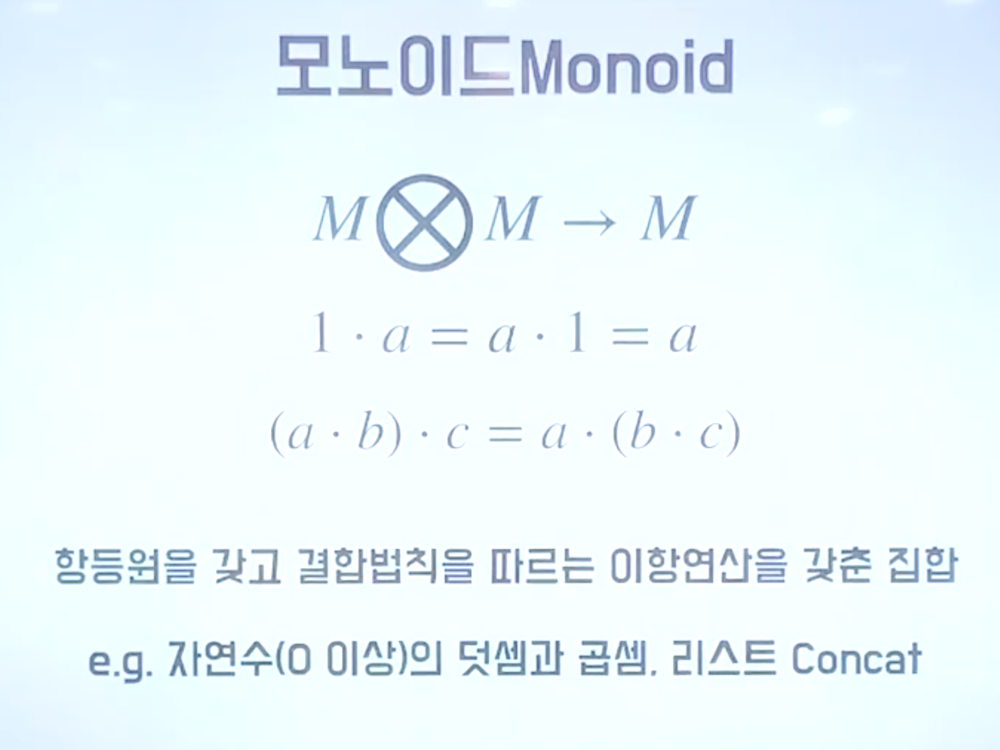
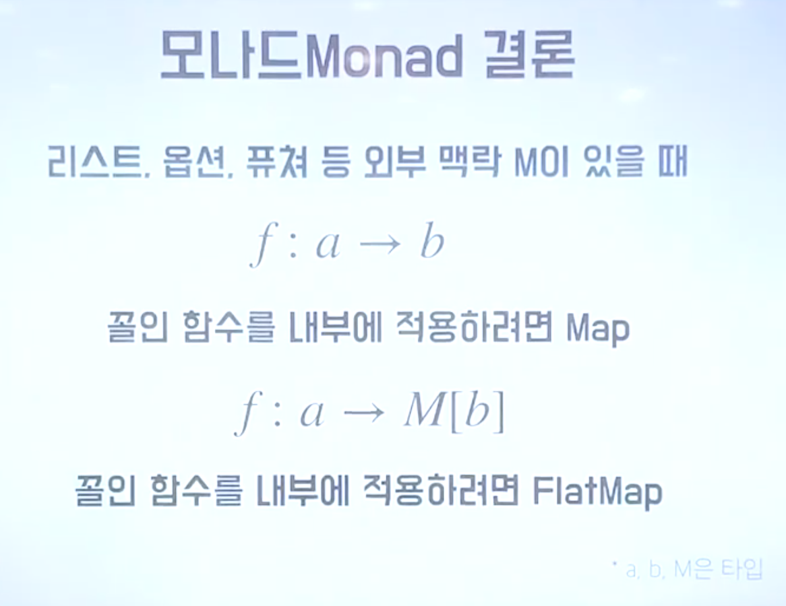

# 모나드

- 임정택과 논의하며, 모나드에 관해 알게된 내용을 정리한다.
- 참고: [도넛의 함수형 프로그래밍](https://youtu.be/ii5hnSCE6No)

## 모나드란?

## [카테고리](https://en.wikipedia.org/wiki/Category_(mathematics)) 란?

 a collection of "objects" that are linked by "arrows"

## Monoid 란?

즉 1) Closed 되어 있고 2) 항등원이 있고 3) 결합 법칙이 성립하는 이항연산을 가진 "집합" 이 monoid 다.

그리고 Monad 에서 말하는 모노이달 카테고리란, Monoid 의 3가지 규칙을 만족하는 이항연산을 가진 카테고리를 말한다.

굳이 집합이 아닌 카테고리라고 말하는 이유는, 구체적인 data value 의 변환(function)이 아닌, data type 의 morphism(functor) 를 살펴보기에는 Set Theory 가 아니라 Category Theory 를 활용하는게 더 적합하기 때문이다.

Set Theory 에서의 Morphism 이 Function이고, Category Theory 에서의 Morphism 이 Functor 이다.

[Set Theory 와 Category Theory 의 관점 차이](https://cs.stackexchange.com/questions/91357/what-exactly-is-the-semantic-difference-between-category-and-set)

그리고 모나드에서 이야기하는 두가지 자연변환이란, map 과 flatmap 을 뜻한다.

- map: I -> T
- flatmap: T * T -> T

## 결론

