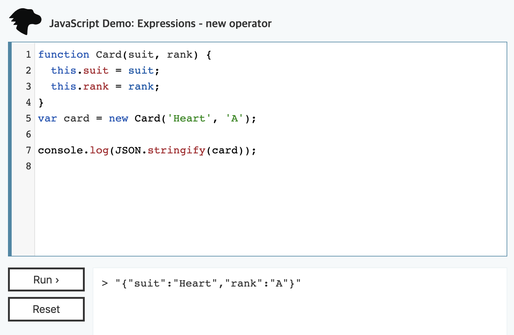

# Ch4. 객체와 배열

## 4.3 생성자

객체를 생성하는 방법 2가지

1. 객체 리터럴(4.1)
2. 생성자

말이 거창하게 생성자(Constructor)이지, 그냥 객체 리터럴을 return 하는 함수.

일반 함수와 차이점: `new`를 통해 `this context`라는 독립된 자신만의 컨텍스트를 가진다.

(위의 사진에 나오듯, `new`가 없으면 `this context`를 인식하지 못한다.)

## 4.4 내장 객체, 내장 생성자

Java의 String 처럼 언어에서 이미 정의되어 있는 생성자를 `내장 생성자` 라고 하고, 내장 생성자를 통해 만들어진 객체를 `내장 객체(Built-in Objects)` 라고 한다.
`내장 객체`는 사용자가 굳이 생성자로 생성하지 않아도 사용할 수 있다.
`전역 객체`는 프로그램의 어느 위치에서나 사용 가능한 객체이다.

(JSON은 내장 객체이자 전역객체에다.)

자바스크립트의 3가지 객체 분류

1. 네이티브 객체(Native Object)
: ECMAScript에 표준으로 정의된 내장 객체. (Object, String ,Number, Function, JSON, Math)
1. 호스트 객체(Host Object)
: ECMAScript의 표준은 아니지만, 실행 환경에 정의된 내장 객체. (Window, History, Location, XMLHttpRequest)
1. 사용자 정의 객체(User Defined Object)
: 사용자가 직접 정의한 객체

어떤 내장 객체들이 있는지는 p.116 - p.120 참조

## 4.5 배열

Javascript에서 배열을 쓰고 싶다면 `TypedArray` 를 쓰자.
그냥 키가 숫자밖에 안되는 해쉬맵이라고 생각하는게 편하다.
arr['3']과 arr[3]이 같은말
**용어 정리**

- `배열 리터럴(literal)`
- - `인덱스(index)`: 키
- `배열 요소(item)`: 값

주의점: <strong style="color:red">length가 배열의 길이를 뜻하지 않는다.</strong>(특히 delete 연산자를 사용했을 때)
이런식으로 length 보다 작은 수의 배열 요소를 가진 배열을 `희소 배열(Sparsed Array)`이라고 한다.
