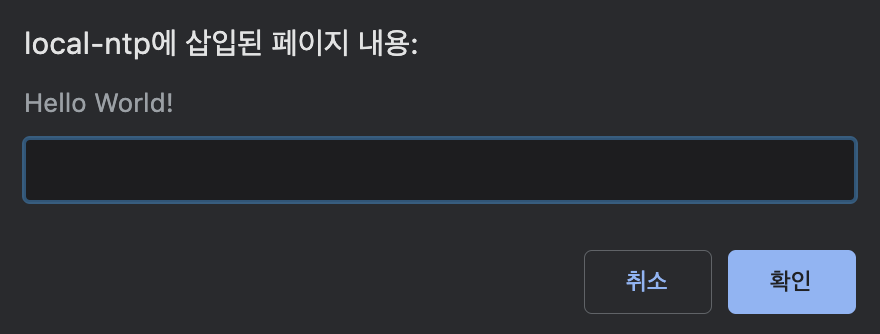

# 6장 웹 브라우저에서의 입출력

## 6.1 대화상자

eslint 같은 문법 체크에서는 대화상자를 쓰지말라고 warning을 띄운다.

- window.alert
    경고 대화상자

    ```JS
    alert('Hello World!');
    ```

    

- window.prompt
    입력 대화상자

    ```JS
    prompt('Hello World!');
    ```

    

- window.confirm
    확인, 취소 버튼이 있는 대화상자

    ```JS
    confirm('Hello World!');
    ```

    

## 6.2 console

메서드 | 설명
---- | ----
console.log | 일반
console.info | 메시지 타입
console.warn | 경고
console.error | 오류
console.dir | 대화형
console.time | 타이머 시작
console.timeEnd | 타이머 정지 후 밀리 세컨드 출력
console.trace | 스택 트레이스 출력

서식 문자열(%o, %d, %i, %s, %f)은 Node.js에서 지원되지 않는다.
차라리 템플릿 리터럴을 쓰자(p.88)
객체를 출력할때는 dir 강추!
```JS
console.dir(obj, { color: true, depth: 5 });
```

## 6.3 이벤트 처리기, 타이머

용어정리

- **이벤트**
    애플리케이션이 처리할 수 있는 동작이나 사건
- **이벤트 처리기**
    핸들러, 이벤트가 발생했을 때 실행되는 함수
- **이벤트 주도형 프로그램**
    이벤트가 발생했을 때 미리 등록해둔 작업을 수행하는 프로그램

함수를 이벤트 처리기로 등록하는 방법

1. HTML 요소의 속성으로 등록
1. DOM 요소의 프로퍼티로 등록
1. addEvent Listener 메서드를 사용

### HTML 요소의 속성으로 등록

html 코드에 자바스크립트 코드 삽입

```html
<!DOCTYPE html>
<html>
    <head>
        <script>
            function onClickHandler() {
                alert('Hello World!');
            }
        </script>
    </head>
    <body>
        <input type="button" value="click" onclick="onClickHandler()">
    </body>
</html>
```

이벤트 처리기 이름들

- onclick
- ondblclick
- onmousedown
- onmouseup
- onmousemove
- onmouseout
- onmouseover
- onkeydown
- onkeypress
- onkeyup
- onchange
- onblur
- onfocus
- onselect
- onsubmit
- onload
- onunloadWeb
- onabort
- onerror
- onresize

### DOM 요소의 프로퍼티로 등록

html 코드와 자바스크립트 코드 분리
DOM 객체(window, document)에 정의된 메서드를 사용하여 HTML 문서를 조작

DOM 객체

- **window**
    브라우저 윈도우를 가리키는 객체
- **document**
    HTML 문서의 전체를 가리키는 객체
- **요소객체**
    HTML문서의 요소를 가리키는 객체

DOM을 통한 HTML 조작법

1. window.onload에 2와 3을 실행하는 이벤트 처리기 등록
    *onload 이벤트: html문서의 body문서를 다 읽었을때 발생하는 이벤트*
1. document.getElementById 메서드로 HTML 요소 객체를 가져옴.
1. 해당 요소 객체에 이벤트 처리기 등록

```html
<!DOCTYPE html>
<html>
    <head>
        <script>
            function onClickHandler() {
                alert('Hello World!');
            }
            window.onload = function () {
                document.getElementById("mybutton").onclick = onClickHandler;
            }
        </script>
    </head>
    <body>
        <input id="mybutton" type="button" value="click">
    </body>
</html>
```

getElementById("...").onclick에서 onclick 처럼 이벤트를 등록하기 위한 프로퍼티를 **이벤트 처리기 프로퍼티** 라고 한다.
이벤트를 제거할 때는 null을 대입한다.

``` JS
        document.getElementById("mybutton").onclick = null;
```

### 타이머

```JS
var millisecond = 512;
function eventHandler() {
    consol.log('Hello World!');
    millisecond *= 2;
}
```

#### setTimeout

일정 시간이 흐른 후에 함수 호출

```JS
setTimeout(eventHandler, millisecond);
```

핸들러 함수 대신, 텍스트를 넣어도 알아서 실행됨.
```JS
setTimeout("alert('Hello World!');", 2000);
```
하지만 크롬같은 선진 브라우저에서는 에러 메시지를 띄우며 실행을 거부하니, 텍스트만 넣지 않는게 좋음
*Refused to evaluate a string as JavaScript because 'unsafe-eval'*

#### setInterval, clearInterval

setInterval: 일정 시간 간격에 따라 반복해서 함수 호출
clearInterval: 반복되는 함수 실행이 취소됨

```JS
var timer = setInterval(eventHandler, millisecond);
if (millisecond > 5000) {
    clearInterval(timer);
}
```
