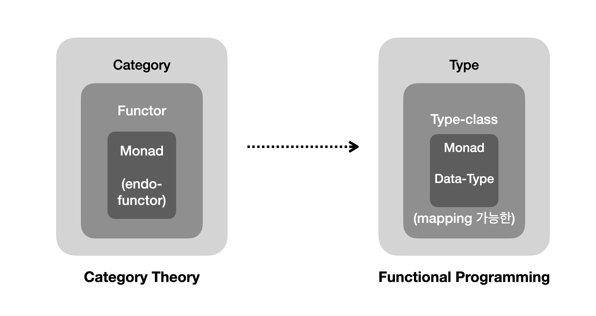
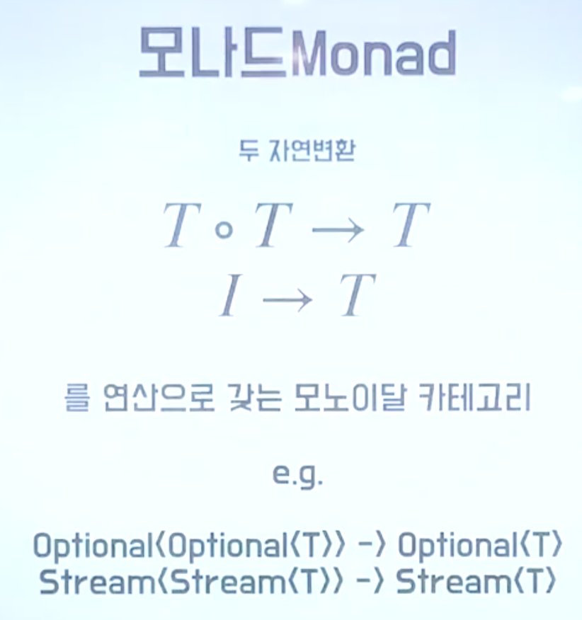
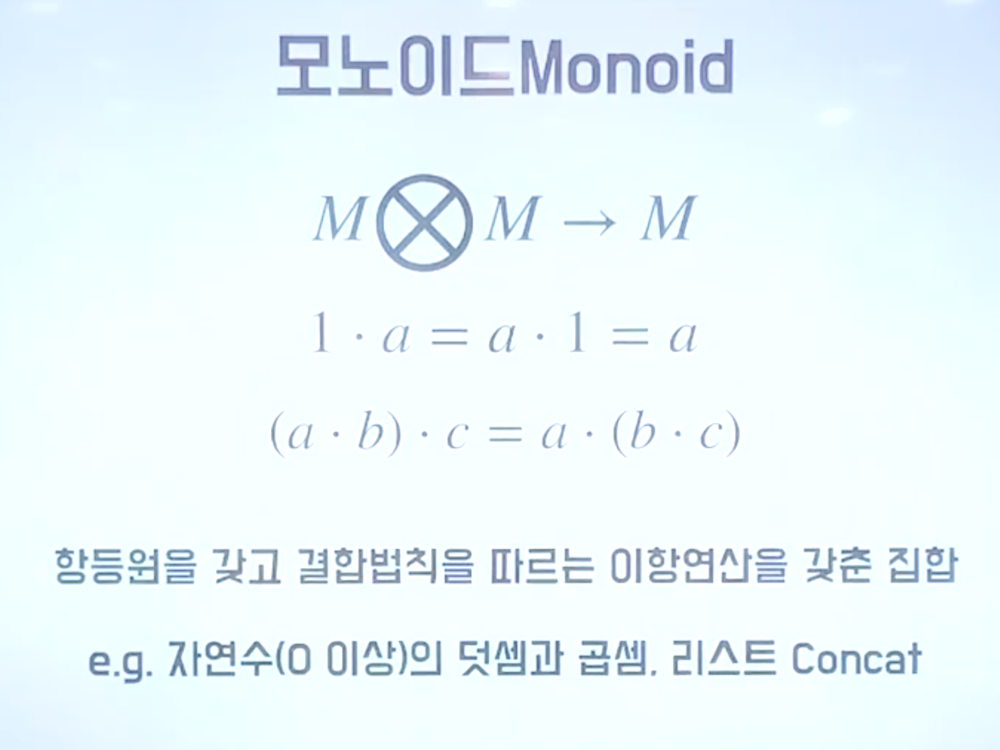
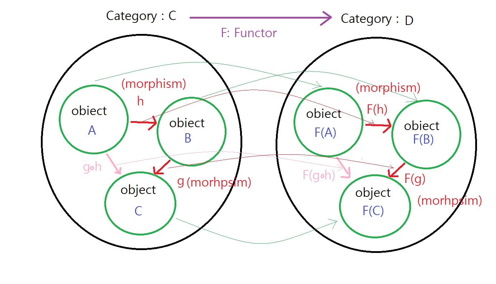
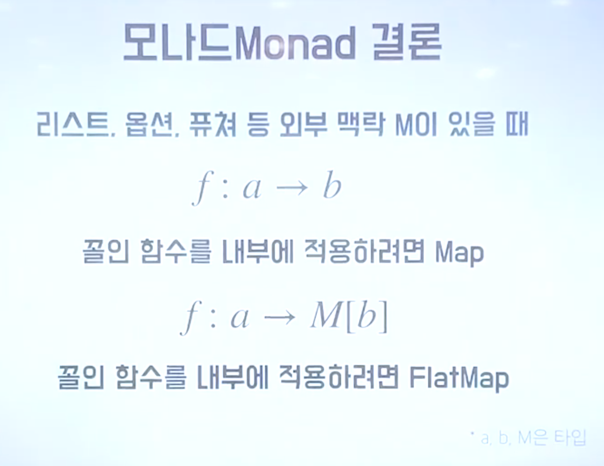

# 모나드

- 모나드에 관해 알게된 내용을 정리한다.
- 참고: [도넛의 함수형 프로그래밍](https://youtu.be/ii5hnSCE6No)

## JK 의 설명

- [Category Theory YouTube](https://www.youtube.com/watch?v=I8LbkfSSR58&list=PLbgaMIhjbmEnaH_LTkxLI7FMa2HsnawM_&index=1)
- [Category Theory in Life](https://www.youtube.com/watch?v=ho7oagHeqNc)
- 범주론에서 FP로 영향을 주었지만 100% 동일하지는 않다 (어차피 수학세계과 프로그래밍 세계는 비슷한 점도 있지만 다른점이 많죠)
- 범주론에서 카테고리는 프로그래밍 세계에서 타입과 매칭되고, functor는 mapping 가능한 타입들(부류)가 된다
- functor는 항등원과 결합법칙에 의해서 변형(transform)될 수 있다
- 범주론에서 Monad는 endo-functor라는 변형이후 다시 자신의 범주가 되는 functor를 의미하는데, 프로그래밍 세계에서는 결국 자기 자신의 타입으로 mapping 되는 타입을 의미한다
- monadic한 타입을 구현하기 위해서 언어마다 접근방식은 다르다.
- monadic한 타입들이 필요한 이유는 순수함수로만 작성하는 FP세상에서, 가변적인 동작들 - 주로 파일이나 네트워크처럼 I/O 처럼 실패할 가능성이 있는 데이터를 별도 타입으로 감싸게 되고 mapping해서 사용하게 되더군요.



## 모나드란?



## [카테고리](<https://en.wikipedia.org/wiki/Category_(mathematics)>) 란?

a collection of "objects" that are linked by "arrows"

## Monoid 란?



즉 1) Closed 되어 있고 2) 항등원이 있고 3) 결합 법칙이 성립하는 이항연산을 가진 "집합" 이 monoid 다.

그리고 Monad 에서 말하는 모노이달 카테고리란, Monoid 의 3가지 규칙을 만족하는 이항연산을 가진 카테고리를 말한다.

굳이 집합이 아닌 카테고리라고 말하는 이유는, 구체적인 data value 의 map(function)이 아닌, data type 의 map(functor) 를 살펴보기에는 Set Theory 가 아니라 Category Theory 를 활용하는게 더 적합하기 때문이다.

Set Theory 에서의 Morphism 이 Function이고,
~~Category Theory 에서의 Morphism 이 Functor 이다.~~

완전히 잘못된 생각이다. Category Theory 에서의 Morphism 은 Functor가 아니다.

morphism은 한 category 안에 있는 object끼리의 mapping 이다.

반면, **functor는 category에서 category로 가는 mapping이다.**



즉 functor 는 카테고리에 있는 object 와 이항연산(morphism) 그리고 morphism 끼리의 합성도 전부 functor 를 통해 mapping 이 되어야 한다.

[Set Theory 와 Category Theory 의 관점 차이](https://cs.stackexchange.com/questions/91357/what-exactly-is-the-semantic-difference-between-category-and-set)

정택의 functor 예시

```txt
카테고리 C의 object가 정수이고,
카테고리 D의 object들이 2^x(x는 정수)집합이 될 때,
C->D로 가는 functor는 object x를 obect 2^x로 mapping하고
C의 morphism은 x를 x+1로 보내는 연산이라고 했을 때, 이 연산들을 합성해서 만들어지는 연산들은 모두 x->x+n 형태.
그럼 D에서는 이 연산을 2^n을 곱하는 연산(2^x->2^(x+n))으로 mapping하면 됨.
```



그리고 모나드에서 이야기하는 두가지 자연변환이란, map 과 flatmap 을 뜻한다.

- map: I -> T
- flatmap: T \* T -> T

## 결론

모나드로 만들어라! 라는 말의 의미는, 내가 만든 map 과 flatmap 의 functor 가 1) closed 되어 있는지 2) 항등원이 존재하는지 3) 결합 법칙이 성립하는지 확인하라는 뜻이다.

1. functor 가 closed 되어야 하는 이유: 당연하지만, closed 되어 있지 않으면 타입이 개판되어서 런타임 에러가 언젠가 발생한다.
2. 항등원이 존재해야하는 이유: 항등원이 있다면 멱등원(idempotent element) 에 따른 멱등성을 매우 쉽게 보장할 수 있기 때문이다. 체크박스 비즈니스 로직에 대한 테스트 코드를 어떻게 작성해야하는 지에 대한 악몽을 떠올려 보라.
3. 결합 법칙이 성립해야하는 이유: functor 를 적용하는 순서에 따라 결과가 달라진다면 디버깅이 괴로워진다. Express 백엔드 미들웨어를 개발하던중, 미들웨어 적용 순서가 꼬여 서버가 터져서 야근해야했던 악몽을 떠올려보라.


